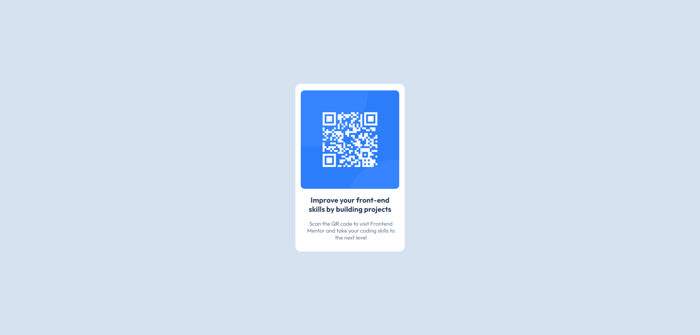

# Frontend Mentor - QR code component solution

This is a solution to the [QR code component challenge on Frontend Mentor](https://www.frontendmentor.io/challenges/qr-code-component-iux_sIO_H). Frontend Mentor challenges help you improve your coding skills by building realistic projects. 

## Table of contents

- [Overview](#overview)
  - [Screenshot](#screenshot)
  - [Links](#links)
- [My process](#my-process)
  - [Built with](#built-with)
  - [What I learned](#what-i-learned)
  - [Continued development](#continued-development)
  - [Useful resources](#useful-resources)
- [Author](#author)
- [Acknowledgments](#acknowledgments)

**Note: Delete this note and update the table of contents based on what sections you keep.**

## Overview

### Screenshot

### Links

- Solution URL: [Add solution URL here](https://your-solution-url.com)
- Live Site URL: [Add live site URL here](https://your-live-site-url.com)

## My process

### Built with

Creado con
HTML5 semántico
Propiedades personalizadas de CSS
Flexbox para el diseño
Flujo de trabajo para dispositivos móviles

### What I learned

Al trabajar en este proyecto, aprendi cómo utilizar propiedades como background-image para incluir imágenes de manera efectiva 
y cómo usar flexbox para centrar elementos tanto verticales como horizontales. Aquí hay un ejemplo de código que me pareció interesante:

.imagen {
    background-image: url('../images/image-qr-code.png');
    background-repeat: no-repeat;
    background-position: center;
    background-size: contain;
    border-radius: 10px;
}

Este fragmento muestra cómo ajustar imágenes de fondo para que se adapten perfectamente al diseño sin distorsionarse.

### Continued development

Quiero seguir practicando más componentes con CSS Gridpara diversificar mis habilidades 
y trabajar con transiciones y animaciones para añadir interactividad a mis proyectos.

## Author

- Website - [Add your name here](https://www.your-site.com)
- Frontend Mentor - [@saraypadilla](https://www.frontendmentor.io/profile/saraypadilla)
- Twitter - [@yourusername](https://www.twitter.com/yourusername)

