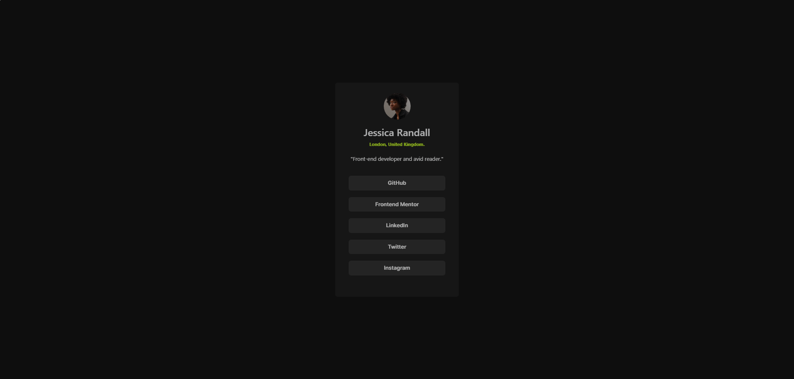

# Frontend Mentor - Social links profile solution

This is a solution to the [Social links profile challenge on Frontend Mentor](https://www.frontendmentor.io/challenges/social-links-profile-UG32l9m6dQ). Frontend Mentor challenges help you improve your coding skills by building realistic projects. 

## Table of contents

- [Overview](#overview)
  - [The challenge](#the-challenge)
  - [Screenshot](#screenshot)
  - [Links](#links)
- [My process](#my-process)
  - [Built with](#built-with)
  - [What I learned](#what-i-learned)
  - [Useful resources](#useful-resources)
- [Author](#author)

## Overview

### The challenge

Users should be able to:

- See hover and focus states for all interactive elements on the page

### Screenshot

### Links

- Solution URL: [Add solution URL here](https://github.com/saraypadilla/Practica/tree/main/social-links-profile-main)
- Live Site URL: [Add live site URL here](https://saraypadilla.github.io/Practica/social-links-profile-main/)

## My process

### Built with

HTML5 semántico
Propiedades personalizadas de CSS
Bootstrap 5 para diseño y estilos
Fuentes personalizadas con @font-face

### What I learned

Mientras trabajaba en este proyecto, reforcé el uso de Bootstrap para maquetación y componentes, combinado con CSS personalizado para cumplir con los requisitos de diseño.

### Useful resources

- [Example resource 1](https://getbootstrap.com/docs/5.3/getting-started/introduction/) - Documentación de Bootstrap - Me ayudó a comprender e implementar diseños responsivos de forma rápida.

## Author

- Frontend Mentor - [@saraypadilla](https://www.frontendmentor.io/profile/saraypadilla)
